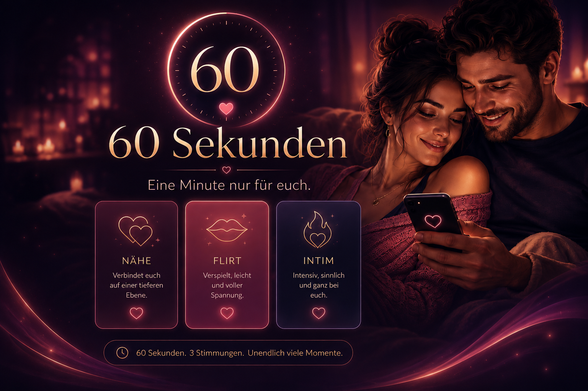

# 60 Sekunden – Ein Paar-Spiel



Es geht um Aufgaben, die man als Paar in **60 Sekunden** angehen muss.

Dabei wird über mehrere Runden jeweils abwechselnd gespielt.
Aus drei Kategorievorschlägen muss eine Aufgabe übernommen werden.

Das Paar hat 60 Sekunden Zeit.

Live: https://bj-eberhardt.github.io/60-sekunden/

Weitere Liebesspiele gibt es auf: https://love-games.app/

# Regeln und Ablauf

- Das Spiel ist für zwei Personen gedacht.
- Zu Beginn werden optional Namen, Geschlechter, Aufgabenkatalog und eine gerade Rundenanzahl zwischen 2 und 12 festgelegt.
- Pro Runde ist abwechselnd eine Person dran.
- Die aktive Person bekommt drei Aufgaben zur Auswahl.
- Aufgaben können neu gezogen oder die Runde kann gepasst werden.
- Nach der Auswahl startet direkt ein Countdown über 60 Sekunden.
- Nach jeder Runde gibt es eine kurze Feedback-Phase.
- Das Spiel endet nach der festgelegten Rundenzahl.

# Features

- Lokales Paar-Spiel als Webapp ohne Backend.
- 60-Sekunden-Countdown pro Aufgabe.
- Abwechselnde Runden für zwei Personen.
- Einstellbare Rundenanzahl von 2 bis 12 Runden.
- Aufgabenauswahl aus drei Vorschlägen pro Runde.
- Aufgabenkataloge mit eigenen Aufgaben.
- Kataloge können importiert, exportiert, kopiert und bearbeitet werden.
- Browser-Persistenz für laufende Spiele und Kataloge.
- Hosted-Version und Docker-Compose-Setup für lokale Nutzung.
- Alle Daten bleiben auf deinem Gerät - keine Werbung, keine Nutzung deiner Daten!

# Nutzung

## Hosted

Kostenlos nutzbare Version gehostet unter: https://60-sekunden.love-games.app/.

## Docker compose

```yml
services:
  app:
    image: beberhardt/60-sekunden:latest
    ports:
      - '8080:80'
    restart: unless-stopped
```

## Docker run

```bash
docker run -d \
  --name 60-sekunden \
  --restart unless-stopped \
  -p 8080:80 \
  beberhardt/60-sekunden:latest
```

# Entwickler

Mehr Informationen für Entwickler gibt es [hier](DEV.md).
